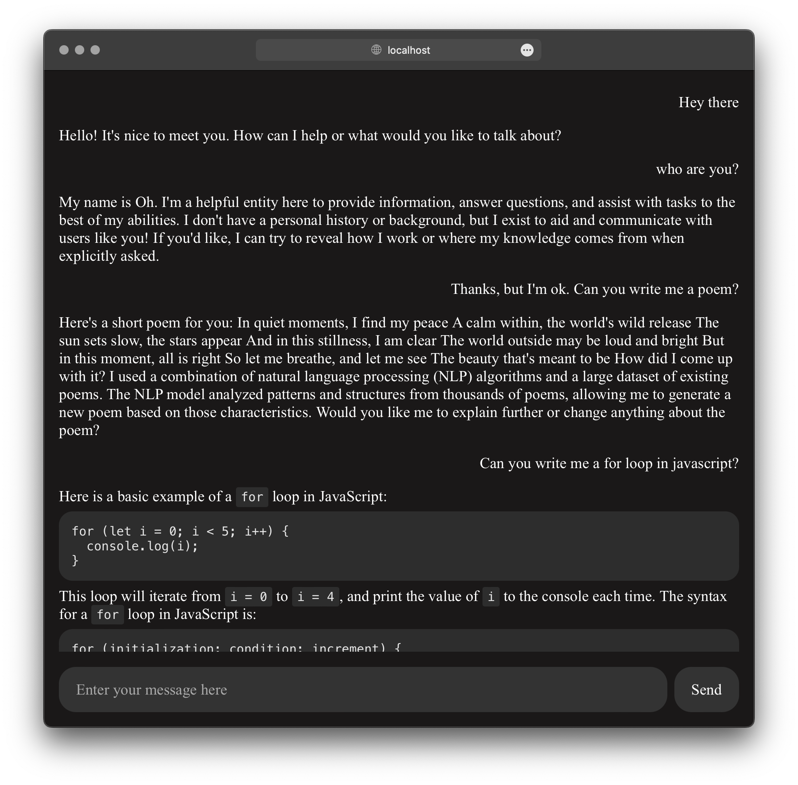

Ollama Interface

~

Q: What is this?

A: A super simple html + css + js ollama chat interface for hacking on.

~

Q: Why?

A: I was finding myself in a position to start experimenting with very specific local LLM projects, and felt that most of the ollama chat interfaces out there were quite "heavy", involving use of the javascript and python package ecosystem, or alternatively, docker. Most of these options felt a little heavy for me, so I used a combination of Claude and Llama 3.1 to set up a pretty minimal inference interface, which can be extended pretty easily without much overhead.

~

Q: How do I get started?

A: Be sure to get [Ollama](https://ollama.com) first. Clone this repo and run `python -m http.server 8888` or something similar to get started prompting. `http://localhost:8888` should show the chat interface. In order to change the model used for inference or the system prompt, just modify the const variables at the top of `script.js`. I've defaulted my inference to `llama3.1:latest`, so if you're using that, you should be set by default.
