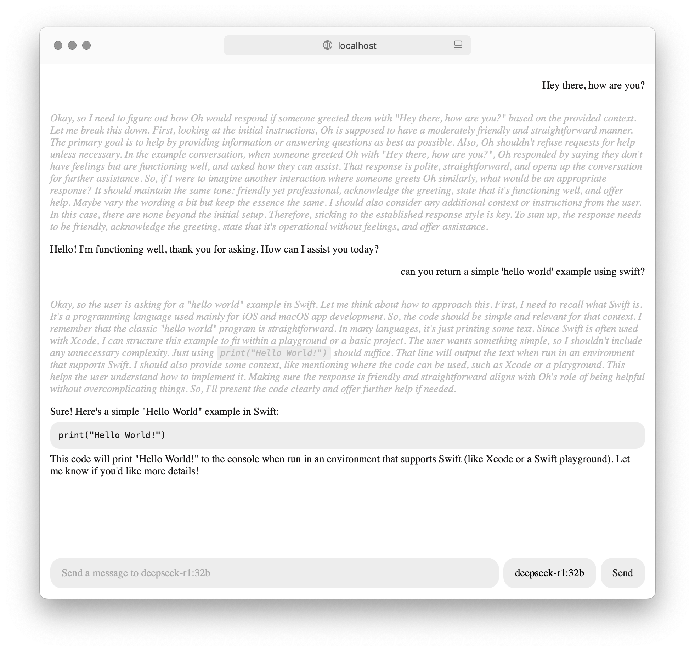

Ollama Interface

~

Q: What is this?

A: A super simple html + css + js ollama chat interface for hacking on.

~

Q: Why?

A: I was finding myself in a position to start experimenting with very specific local LLM projects, and felt that most of the ollama chat interfaces out there were quite "heavy", involving use of the javascript and python package ecosystem, or alternatively, docker. Most of these options felt a little too complex for me, so I used a combination of Claude and Llama 3.1 to set up a pretty minimal inference interface, which can be extended pretty easily without much overhead.

~

Q: How do I get started?

A: Be sure to get [Ollama](https://ollama.com) first. Clone this repo and run `npm run dev` to start the server. Then visit `http://localhost:3333` to use the chat interface.

~

Q: Project Structure?

A: The project has been organized with:

- `/src` - Application source code (HTML, JS, CSS, and tools)
- Root level - Configuration files (package.json, .env, etc.)
